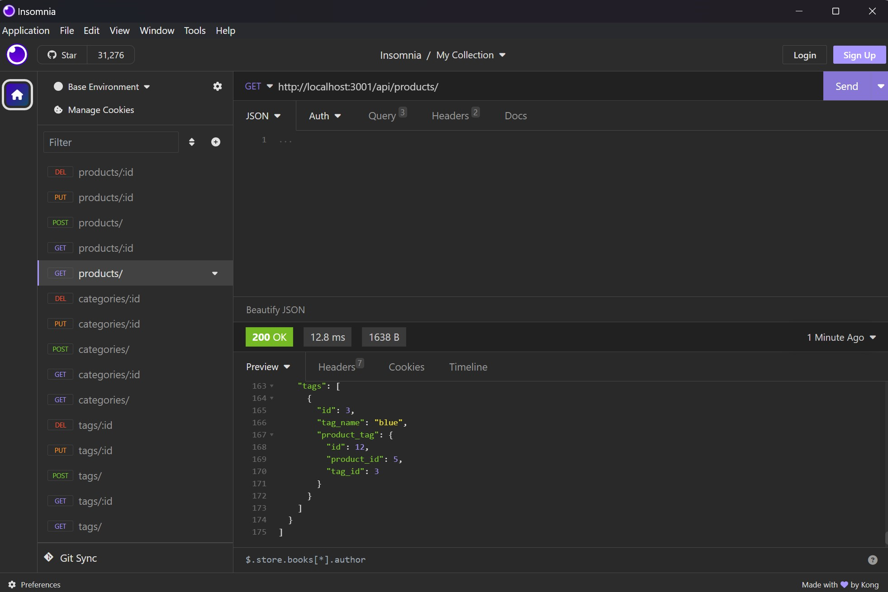

# ECommerce Backend

## Description

Back end routes for an e-commerce business

## Table of Contents

- [Installation](#installation)
- [Usage](#usage)
- [License](#license)
- [Contributing](#contributing)
- [Tests](#tests)

## Installation

Installation/cloning available at the repository

## Usage

Boot up mysql and source the schema file then you can run _node seeds/index.js_ to seed it with basic data (optional). Then run _node server.js_ to start the backend where you can make api requests to http://localhost:3001/api

Demo here:
https://drive.google.com/file/d/1ikcLickhmM4yDDAfUQhlA5yxWCNpi87L/view?usp=sharing

## License

This project is licensed under the [MIT License]([License Details](https://opensource.org/licenses/MIT)).

## Contributing

Cardon Hickman, U of U Fullstack Bootcamp

## Tests

N/A

## Questions

https://github.com/C-Hickman3
cardonhickman@gmail.com
